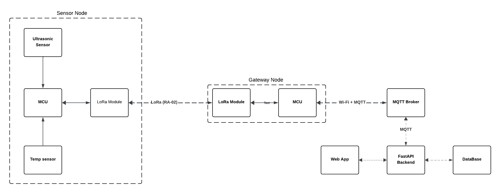

# Smart-River-Water-Level-Monitoring-and-Alert-System
Affordable, maintainable river water level gauge with Alert System

This project presents a cost-effective and maintainable river water level monitoring and alert system. It is specifically designed for deployment in remote or rural areas where conventional solutions are too expensive, require complex maintenance, or rely heavily on satellite communication.

The system uses a combination of low-power hardware and modern wireless communication technologies to continuously monitor water levels and issue alerts when thresholds are exceeded.

---

## Problem Statement

In many rural regions, communities suffer from a lack of early warning systems for floods or droughts. Manual monitoring is inefficient and unreliable, and existing systems are often:

- Too expensive
- Dependent on strong internet connectivity
- Complex to maintain and operate

---

## Objectives

- Measure river water levels in real time  
- Show the current water level relative to a defined normal level  
- Provide alerts when water levels reach critical thresholds  
- Log and visualize data on a cloud dashboard  
- Ensure the system is low-power and suitable for remote deployments  
- Maintain a low-cost, easy-to-maintain design  

---

## Solution Overview

The system comprises:

- **Sensor Unit**: Ultrasonic sensor mounted facing the river to measure water levels based on distance  
- **Microcontroller**: ESP32 reads sensor data and manages communication  
- **Communication Module**: Data sent via LoRa or Cellular, depending on availability  
- **Cloud Integration**: Real-time data uploaded for monitoring and analytics  
- **Alert System**: Threshold-based alerts (LOW, MEDIUM, HIGH) via web application and buzzer  

---

## Deployment Scenario

The system is installed beside a river or on a bridge, with the ultrasonic sensor facing downward toward the water surface. The MCU reads the water level and temperature sensor data using one or two Sensors then get calculate average from that  multiple readings for accuracy, and applies temperature correction.

Data is transmitted using the LoRa protocol to a central MCU(ESP32), which then connects to Wi-Fi and sends the data to the server using MQTT. The server processes the data, visualizes it, and sends notifications to users.

The device is battery-powered for off-grid use, enclosed in a weatherproof housing. Future versions include a solar panel for sustainable charging.

---

## Key Features

- Real-time water level monitoring  
- Cloud dashboard integration  
- Alert system for flood and overflow conditions  
- Energy-efficient and robust for outdoor use  
- Cost-effective and easy to deploy  

---

## Impact

This project aims to:

- Improve preparedness for water-related disasters in rural areas  
- Enable remote monitoring and early warning systems  
- Reduce costs compared to traditional telemetry or satellite-based systems  

