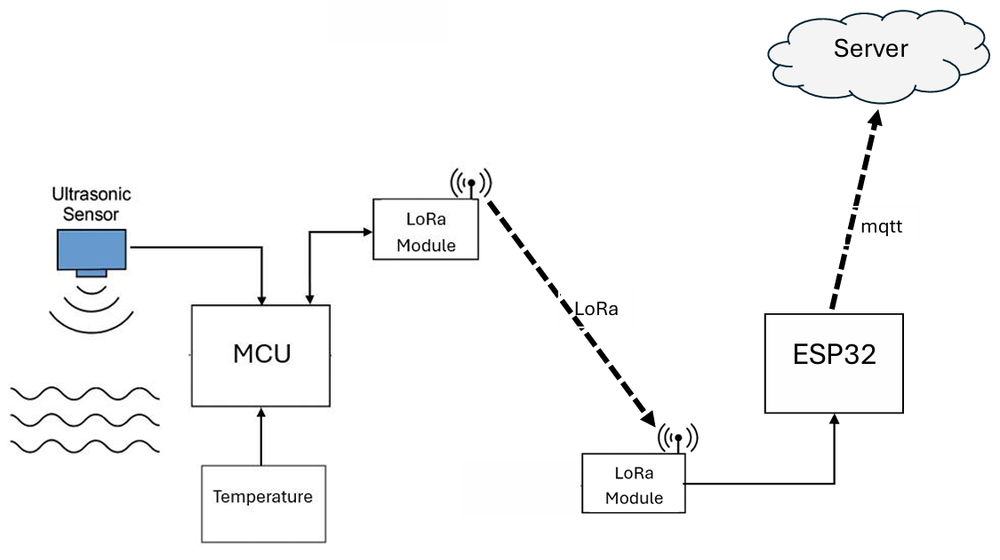

# Smart-River-Water-Level-Monitoring-and-Alert-System
Affordable, maintainable river water level gauge with Alert System

## Project Summary

This project presents a cost-effective and maintainable river water level monitoring and alert system. It is specifically designed for deployment in remote or rural areas where conventional solutions are either too expensive, require complex maintenance, or rely heavily on satellite communication.

The system uses a combination of low-power hardware and modern wireless communication technologies to continuously monitor water levels and issue alerts when thresholds are exceeded.

---

## Objectives

- Develop a reliable, low-cost system for real-time river water level monitoring.
- Reduce dependency on high-maintenance and high-cost systems.
- Enable location-tagged data reporting through GPS.
- Provide local (on-site) alerts and remote alerts via MQTT.
- Ensure suitability for harsh, moisture-prone environments.

---

## Key Features

- Real-time river water level monitoring
- Location tagging using GPS
- Low-power NB-IoT-based cellular communication
- MQTT-based data publishing
- On-site audio alert system (buzzer/speaker)
- Compatibility with mobile and cloud-based dashboards
- Waterproof ultrasonic sensor suitable for outdoor environments

---

## 🗓️ 12-Week Project Timeline – Water Level Monitoring System

| **Week** | **Tasks** |
|----------|-----------|
| **Week 1** | • Finalize the project idea and use case. • Define high-level objectives (e.g., monitor, alert, transmit water level). |
| **Week 2** | • Research existing water level monitoring systems. • Identify real-world issues with data transmission and alerting. |
| **Week 3** | • Research affordable and reliable components (e.g., sensors, ESP32, NB-IoT modules). • Compare alternatives based on cost, power usage, and compatibility. |
| **Week 4** | • Select and finalize components based on Week 3 findings. • Create a detailed block diagram and system design. |
| **Week 5** | • Begin testing selected components individually (sensor, ESP32, buzzer, NB-IoT module). • Test basic connectivity and data reading. |
| **Week 6** | • Develop water level detection logic on ESP32. • Add buzzer activation for alert conditions. |
| **Week 7** | • Set up and test communication between ESP32 and NB-IoT module using AT commands. • Format sensor data for transmission. |
| **Week 8** | • Develop or simulate backend endpoint (cloud/server). • Send test data from ESP32 via NB-IoT to destination. |
| **Week 9** | • Integrate all parts: water level sensing + logic + buzzer + NB-IoT transmission. • Add failure detection and retries. |
| **Week 10** | • Design enclosure for components (weatherproof if needed). • Power supply planning and integration. |
| **Week 11** | • Field testing in real environment (e.g., water tank). • Adjust thresholds and calibrate sensors. |
| **Week 12** | • Final debugging and optimization. • Document the system, update README, and prepare presentation/demo. |

## Hardware Components

| Component                         | Description                                                         |
|----------------------------------|----------------------------------------------------------------------|
| ESP32 Microcontroller            | Main controller for logic, sensor reading, and serial communication  |
| A02YYUW Ultrasonic Sensor        | Waterproof, accurate distance measurement                            |
| NB-IoT Module (e.g., SIM7020)    | Cellular communication using MQTT protocol                           |
| GPS Module (e.g., NEO-M8N)       | Provides station location data                                       |
| Buzzer or Speaker                | Provides audible alerts for high water levels                        |
| Power Supply                     | Rechargeable battery, optionally solar powered                       |

---
## Why ESP32?

While several microcontrollers are suitable for embedded IoT applications, this project uses the **ESP32** (without Wi-Fi/BLE) for several important reasons:

### Benefits of Using ESP32:

- **Dual-core processor** (Tensilica Xtensa LX6) → allows concurrent tasks (e.g., sensor polling + NB-IoT communication)
- **More Flash/RAM** than STM32 Blue Pill → easier for MQTT, GPS parsing, sensor filtering
- **Supports multiple UARTs** → useful when using GPS, NB-IoT module, and debugging over serial
- **Good development ecosystem** → widely supported in Arduino and ESP-IDF environments
- **Lower development time** due to rich libraries and community support

---

## System Architecture

1. The ESP32 reads water level data from the ultrasonic sensor.
2. The water level is calculated relative to a defined normal threshold.
3. If the level exceeds the threshold:
   - An on-site buzzer or speaker is activated.
   - Data is sent via MQTT using the NB-IoT module.
4. GPS coordinates are attached to each data packet.
5. A remote dashboard or app can visualize and monitor data in real time.

---

## Technical Advantages

- Uses NB-IoT for low power, long-range, and cost-efficient data transmission.
- MQTT protocol allows lightweight communication ideal for IoT applications.
- GPS-based station identification enables support for multiple monitoring sites.
- Waterproof sensor ensures durability in high-moisture outdoor environments.
- ESP32 allows easy firmware development and wireless integration.

---

## Application Scenarios

- River and canal monitoring for flood-prone areas
- Water level logging for environmental agencies
- Smart agriculture and irrigation control
- Early warning systems for disaster management

---

## 🗓️ 12-Week Project Timeline – Water Level Monitoring System

| **Week** | **Tasks** |
|----------|-----------|
| **Week 1** | • Finalize project scope and objectives. • Research existing water level monitoring systems and decide on technologies (ESP32, NB-IoT, etc.). |
| **Week 2** | • Select components: sensors, ESP32, NB-IoT module, buzzer, power unit. • Procure required hardware. |
| **Week 3** | • Test individual components: water level sensor, ESP32, buzzer. • Blink test and serial output checks. |
| **Week 4** | • Set up serial communication between ESP32 and NB-IoT module (e.g., AT commands). • Test basic data send. |
| **Week 5** | • Integrate water level sensor with ESP32. • Read and filter sensor data (analog/digital). |
| **Week 6** | • Implement water level logic (e.g., critical levels). • Add buzzer control for alerts. |
| **Week 7** | • Develop firmware to send data via NB-IoT. • Format sensor data (JSON/CSV) for transmission. |
| **Week 8** | • Set up cloud endpoint or test server (optional). • Connect NB-IoT output to destination. |
| **Week 9** | • Perform system integration test: sensor → ESP32 → NB-IoT → cloud + buzzer alert. • Add failure handling. |
| **Week 10** | • Design and build system casing/enclosure. • Ensure protection against water/weather. |
| **Week 11** | • Deploy in real environment (e.g., water tank). • Monitor data and performance. |
| **Week 12** | • Final testing and optimization. • Write documentation, finalize README, and prepare for demo. |

## Future Enhancements

- Integration with solar charging for full off-grid capability
- Cloud-based historical data logging and analytics
- SMS alert integration using GSM fallback
- Real-time map-based dashboard with station statuses

---

## License

This project is released under the MIT License. You are free to use, modify, and distribute this software with proper attribution.

---

## Author

[Rashmika Naveen]  
